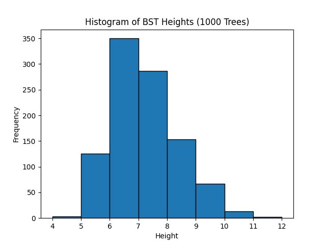

BST vs AVL Analysis Report
This project reuqired building a Binary Search Trees from 1000 random permuattions of numbers 1-20. 
We recorded each tree's height and root node imbalances to evaluate BST performance. 
Then used the AVL Trees to balance the most imbalaneced trees and observed improvements in height and rotations required. 

Implementation 
1. A custom BST class was implemented with insert, height(iterative), and imbalance measurement. 
2. Each tree was built from a different random permutation using 'random.sample()'
3. the height and imbalances of the root were recorded for each tree
4. Created height_historgram and imbalance_historgram using matplotlib to visulize the distrubtion of tree heights and imbalances. 
5. the two most imbalanced trees were rebuilt using AVL trees with automatic reblancing
6. the number of AVL rotaitons and hieght reduction were recorded 

Height Histogram 

Imbalance Histogram

Conclusion 
BSTs built from random were unbalalnced and tall. 
The AVL trees automatically reblance to maintain lograthimic height. This reblanacing significantly reduces height and improves performance 
